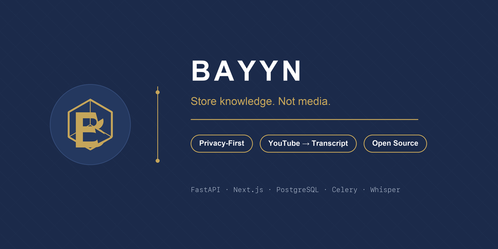
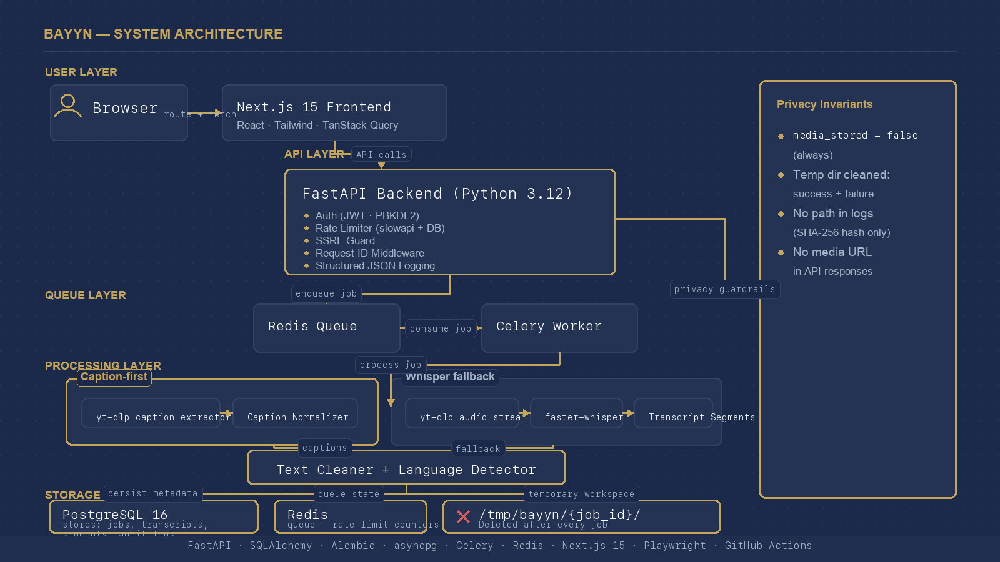

<!-- Banner -->
<p align="center">
  
</p>

<p align="center">
  <a href="https://github.com/YASSERRMD/bayyn/releases/tag/v0.1.0"></a>
  <a href=".github/workflows/ci.yml"></a>
  <a href="#testing"></a>
  <a href="LICENSE"></a>
</p>

<p align="center">
  <b>Paste a link. Get the transcript. Keep the knowledge, not the media.</b>
</p>

---

## What is Bayyn?

Bayyn is a **privacy-first URL-to-transcript platform**. Submit any YouTube URL and receive a clean, searchable, exportable transcript — without ever storing the video or audio.

The core principle: **every media file is temporary.** Bayyn processes it to extract the spoken word, deletes it immediately, and only persists the text. The `media_stored` database column is always `false` — enforced in code and verified by automated tests on every commit.

---

## Architecture

<p align="center">
  
</p>

### Stack

| Layer | Technology |
|-------|-----------|
| **Frontend** | Next.js 15, TypeScript, Tailwind CSS, shadcn/ui, TanStack Query |
| **Backend** | FastAPI, Python 3.12, SQLAlchemy 2.x, Alembic, asyncpg |
| **Queue** | Celery 5, Redis 7 |
| **Database** | PostgreSQL 16 |
| **Transcription** | yt-dlp → captions first; ffmpeg + faster-whisper fallback |
| **CI** | GitHub Actions (backend tests + tsc + Playwright E2E) |

---

## Privacy Guarantees

### What Is Stored

| Data | Stored |
|------|--------|
| Transcript full text | ✅ Yes |
| Timestamped segments | ✅ Yes |
| Source URL | ✅ Yes |
| Video title & duration | ✅ Yes |
| Language & status | ✅ Yes |
| Created date | ✅ Yes |

### What Is **Never** Stored

| Data | Stored |
|------|--------|
| Video files | ❌ Never |
| Audio files | ❌ Never |
| Downloaded media | ❌ Never |
| Temp file paths | ❌ Never logged |
| Raw media URLs | ❌ Never logged |

> Every per-job temp directory is deleted immediately after the job completes — on success **and** on failure. Startup cleanup removes any stale directories older than one hour.

---

## Quick Start

### Prerequisites

- Docker and Docker Compose

### Run

```bash
git clone https://github.com/YASSERRMD/bayyn.git && cd bayyn

# Copy the environment template and set a strong secret key
cp backend/.env.example .env
# python -c "import secrets; print(secrets.token_hex(32))"
# → paste the output as SECRET_KEY in .env

docker compose up --build
```

| Service | URL |
|---------|-----|
| Frontend | http://localhost:3000 |
| Backend API | http://localhost:8000 |
| Swagger UI *(dev only)* | http://localhost:8000/docs |

---

## API Reference

### Transcription

| Method | Endpoint | Auth | Description |
|--------|----------|------|-------------|
| `POST` | `/api/transcriptions` | Optional | Submit a URL for transcription |
| `GET` | `/api/transcriptions` | Required | Your job history |
| `GET` | `/api/transcriptions/{id}` | Optional | Job status and metadata |
| `GET` | `/api/transcriptions/{id}/transcript` | Optional | Full transcript + segments |
| `PATCH` | `/api/transcriptions/{id}/segments/{seq}` | Optional | Edit a segment |
| `DELETE` | `/api/transcriptions/{id}` | Optional | Soft-delete a job |
| `GET` | `/api/transcriptions/{id}/export/txt` | Optional | Export as plain text |
| `GET` | `/api/transcriptions/{id}/export/srt` | Optional | Export as SRT subtitles |
| `GET` | `/api/transcriptions/{id}/export/docx` | Optional | Export as Word document |
| `POST` | `/api/transcriptions/{id}/summary` | Optional | AI summary *(if enabled)* |

### Auth

| Method | Endpoint | Description |
|--------|----------|-------------|
| `POST` | `/api/auth/register` | Create an account |
| `POST` | `/api/auth/login` | Sign in, receive JWT |
| `GET` | `/api/auth/me` | Verify token / get user info |

### Admin *(requires `is_admin` claim)*

| Method | Endpoint | Description |
|--------|----------|-------------|
| `GET` | `/api/admin/jobs` | All jobs — filterable, paginated |
| `GET` | `/api/admin/jobs/{id}` | Single job metadata |
| `GET` | `/api/metrics` | Processing stats (success rate, avg duration, …) |

### System

| Method | Endpoint | Description |
|--------|----------|-------------|
| `GET` | `/health` | Liveness |
| `GET` | `/health/detailed` | DB + Redis connectivity |

---

## Environment Variables

| Variable | Default | Notes |
|----------|---------|-------|
| `APP_ENV` | `development` | Set `production` to enable startup guards |
| `SECRET_KEY` | *(insecure placeholder)* | **Required** in production — ≥32 chars |
| `DATABASE_URL` | `postgresql+asyncpg://…` | Async PostgreSQL connection |
| `SYNC_DATABASE_URL` | `postgresql://…` | Sync connection (Alembic + Celery) |
| `REDIS_URL` | `redis://redis:6379/0` | Redis connection |
| `CORS_ORIGINS` | `["http://localhost:3000"]` | JSON list of allowed origins |
| `TEMP_DIR` | `/tmp/bayyn` | Per-job temp processing directory |
| `MAX_VIDEO_DURATION_SECONDS` | `7200` | Maximum video length |
| `JOB_TIMEOUT_SECONDS` | `3600` | Max Celery task runtime |
| `WHISPER_MODEL` | `large-v3` | faster-whisper model size |
| `RATE_LIMIT_PER_MINUTE` | `10` | Per-IP request cap (POST routes) |
| `MAX_ACTIVE_JOBS_PER_USER` | `5` | Concurrent jobs cap per user |
| `MAX_DAILY_JOBS_PER_USER` | `20` | Daily job cap per user |
| `JWT_EXPIRE_MINUTES` | `10080` | Token lifetime (default 7 days) |
| `ENABLE_LLM_SUMMARY` | `false` | Enable OpenAI summary endpoint |
| `OPENAI_API_KEY` | *(empty)* | Required when `ENABLE_LLM_SUMMARY=true` |

See [`backend/.env.example`](backend/.env.example) for the fully annotated template.

---

## Security Model

| Concern | Mitigation |
|---------|-----------|
| **SSRF** | URL validator blocks private IPs (RFC 1918, loopback, link-local, `169.254.x.x`), non-http schemes (`file://`, `ftp://`, `javascript:`) |
| **Rate limiting** | Per-IP slowapi on POST routes + per-user DB checks (active cap + daily cap) |
| **Authentication** | PBKDF2-HMAC-SHA256 passwords · HS256 JWT · `is_admin` claim embedded in token |
| **Ownership** | Per-job access returns `404` for wrong user or missing job (anti-enumeration) |
| **JWT attacks** | `alg=none`, empty signature, wrong secret, forged `is_admin` — all verified in `test_security.py` |
| **Error leakage** | `classify_error()` returns generic messages; `sanitize_for_audit()` strips URLs and paths from tracebacks |
| **Production guards** | Startup fails if `SECRET_KEY` is the insecure default, too short (<32 chars), or `DATABASE_URL` is localhost |
| **API docs** | Swagger UI disabled (`docs_url=None`) when `APP_ENV=production` |

### Blocked IP Ranges

```
127.0.0.0/8       Loopback
10.0.0.0/8        Private (RFC 1918)
172.16.0.0/12     Private (RFC 1918)
192.168.0.0/16    Private (RFC 1918)
169.254.0.0/16    Link-local (AWS metadata at 169.254.169.254)
::1               IPv6 loopback
fc00::/7          IPv6 unique local
fe80::/10         IPv6 link-local
```

---

## Worker Flow

```
1. Load job from PostgreSQL
2. Mark status → processing
3. Create /tmp/bayyn/{job_id}/
4. Resolve metadata (no media download)

   ┌── Caption-first ──────────────────┐
   │  yt-dlp extract captions           │
   │  Normalize + confidence score      │
   └───────────────────────────────────┘
           OR
   ┌── Whisper fallback ───────────────┐
   │  yt-dlp resolve audio stream URL  │
   │  ffmpeg pipe → faster-whisper     │
   └───────────────────────────────────┘

5. Text clean + language detect
6. Store transcript_documents + transcript_segments
7. Set media_stored = false, status = completed
8. DELETE /tmp/bayyn/{job_id}/   ← always, success or failure
9. Write audit log
```

On any exception: temp dir deleted → exponential-backoff retry (×3) → dead-letter.

---

## Testing

```bash
# Backend — unit tests (no DB required)
cd backend && pip install -e ".[dev]"
pytest --ignore=tests/test_source_adapters.py --ignore=tests/test_whisper_processor.py

# Backend — full suite with real DB
docker compose run --rm backend pytest --cov=app --cov-report=term-missing

# Frontend — Playwright E2E
cd frontend && npm install
npx playwright install --with-deps chromium
npx playwright test
```

CI runs automatically on every PR via [`.github/workflows/ci.yml`](.github/workflows/ci.yml):
- Backend: Python 3.12, PostgreSQL 16, Redis 7, full test suite + ruff + alembic
- Frontend: tsc, eslint, `next build`
- Playwright: Chromium, all E2E tests

**323 tests** across 25 test files — unit, integration, security, performance, temp compliance, E2E, and QA assertions.

---

## Verification Checklist

After `docker compose up --build`:

```bash
# Register + sign in
TOKEN=$(curl -s -X POST http://localhost:8000/api/auth/login \
  -H "Content-Type: application/json" \
  -d '{"email":"you@example.com","password":"yourpassword"}' | jq -r .access_token)

# Submit a URL
curl -s -X POST http://localhost:8000/api/transcriptions \
  -H "Authorization: Bearer $TOKEN" \
  -H "Content-Type: application/json" \
  -d '{"url":"https://www.youtube.com/watch?v=dQw4w9WgXcQ"}'

# Check job status (replace {id})
curl -s -H "Authorization: Bearer $TOKEN" \
  http://localhost:8000/api/transcriptions/{id}

# Get transcript
curl -s -H "Authorization: Bearer $TOKEN" \
  http://localhost:8000/api/transcriptions/{id}/transcript
```

- [x] Frontend at http://localhost:3000
- [x] Register · sign in · history guard redirects
- [x] YouTube URL → job created → `media_stored: false`
- [x] Caption-first strategy (captioned videos)
- [x] Whisper fallback (non-captioned videos)
- [x] TXT / SRT / DOCX export
- [x] Soft delete
- [x] `X-Request-ID` in every response header
- [x] Private IPs and `file://` URLs rejected
- [x] Admin jobs list at `/api/admin/jobs`
- [x] Production startup rejects insecure `SECRET_KEY`

---

## Roadmap

<details>
<summary>All 43 phases — click to expand</summary>

- [x] Phase 1: Repository and git setup
- [x] Phase 2: Backend foundation (FastAPI, models, migrations)
- [x] Phase 3: Security and URL validation
- [x] Phase 4: Job API endpoints
- [x] Phase 5: Queue and Celery worker
- [x] Phase 6: Source adapter framework (YouTube)
- [x] Phase 7: Caption-first transcription
- [x] Phase 8: Whisper fallback
- [x] Phase 9: Transcript APIs and exports
- [x] Phase 10: Frontend foundation
- [x] Phase 11: Frontend user flow
- [x] Phase 12: Docker Compose
- [x] Phase 13: Documentation and verification
- [x] Phase 14: Retry and dead-letter handling
- [x] Phase 15: Error handling and audit logging
- [x] Phase 16: Text cleaning and normalization
- [x] Phase 17: Long video chunking
- [x] Phase 18: Language detection
- [x] Phase 19: Caption confidence scoring
- [x] Phase 20: Segment editing API
- [x] Phase 21: Export formats (TXT, SRT, DOCX)
- [x] Phase 22: Soft delete
- [x] Phase 23: Progress tracking
- [x] Phase 24: User authentication (PBKDF2 + JWT)
- [x] Phase 25: Auth endpoints and frontend auth API
- [x] Phase 26: User ownership and authorization
- [x] Phase 27: Per-user rate limiting
- [x] Phase 28: Admin role and visibility
- [x] Phase 29: Observability (request ID, structured logging)
- [x] Phase 30: Metrics endpoint
- [x] Phase 31: Frontend auth UI (login, register, history guard)
- [x] Phase 32: Playwright E2E tests
- [x] Phase 33: Integration testing
- [x] Phase 34: Security testing (SSRF, JWT forgery, sanitization)
- [x] Phase 35: Temp file compliance testing
- [x] Phase 36: Performance benchmarks
- [x] Phase 37: GitHub Actions CI pipeline
- [x] Phase 38: Production config (startup guards, CORS, .env.example)
- [x] Phase 39: LLM summary plugin (optional OpenAI integration)
- [x] Phase 40: QA assertions (cross-cutting invariant tests)
- [x] Phase 41: Documentation update
- [x] Phase 42: Release preparation
- [x] Phase 43: Final release — v0.1.0

</details>

**Coming up:**
- Twitter/X source adapter
- Vimeo source adapter
- Podcast RSS adapter
- Direct MP4 upload adapter
- Speaker diarization
- Multi-language UI

---

## Security Policy

See [SECURITY.md](SECURITY.md) for responsible disclosure information, full URL validation spec, and the temp file audit policy.

---

<p align="center">
  <i>Bayyn does not store video or audio. Only the transcript is saved.</i><br/>
  <a href="https://github.com/YASSERRMD/bayyn/releases/tag/v0.1.0">v0.1.0</a> · MIT License
</p>
