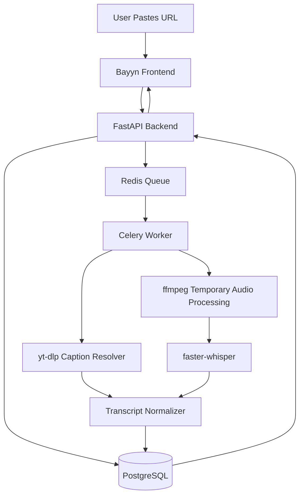

# Bayyn

> Paste a link. Get the transcript. Keep the knowledge, not the media.

## What is Bayyn?

Bayyn is a privacy-first URL-to-transcript application. Paste a video URL and get a clean, exportable transcript — without ever storing the video or audio file.

## Product Principle: Store Knowledge, Not Media

Bayyn processes video temporarily to extract the spoken word, then discards the media immediately. Only the transcript lives on.

## What Is Stored

| Data | Stored |
|------|--------|
| Transcript full text | ✅ Yes |
| Timestamped segments | ✅ Yes |
| Source URL | ✅ Yes |
| Source type (youtube, etc.) | ✅ Yes |
| Video title | ✅ Yes |
| Duration (seconds) | ✅ Yes |
| Language | ✅ Yes |
| Processing status | ✅ Yes |
| Created date | ✅ Yes |

## What Is Never Stored

| Data | Stored |
|------|--------|
| Video files | ❌ Never |
| Audio files | ❌ Never |
| Thumbnails | ❌ Never |
| Downloaded media | ❌ Never |
| Temp file paths | ❌ Never logged |
| Raw media URLs | ❌ Never logged |

## Architecture



**Stack:**
- **Frontend**: Next.js 15, TypeScript, Tailwind CSS, shadcn/ui, TanStack Query
- **Backend**: FastAPI, Python 3.12, SQLAlchemy 2.x, Alembic, asyncpg
- **Worker**: Celery, Redis
- **Database**: PostgreSQL 16
- **Transcription**: yt-dlp → captions first, ffmpeg + faster-whisper fallback

## Local Setup

### Prerequisites

- Docker and Docker Compose
- (Optional) Python 3.12 + Node 20 for local dev

### Run with Docker

```bash
cp .env.example .env
docker compose up --build
```

Frontend: http://localhost:3000  
Backend API: http://localhost:8000  
API Docs: http://localhost:8000/docs

## Environment Variables

| Variable | Default | Description |
|----------|---------|-------------|
| `DATABASE_URL` | `postgresql+asyncpg://...` | Async DB URL |
| `SYNC_DATABASE_URL` | `postgresql://...` | Sync DB URL (Alembic) |
| `REDIS_URL` | `redis://redis:6379/0` | Redis URL |
| `TEMP_DIR` | `/tmp/bayyn` | Temp processing dir (ephemeral) |
| `MAX_VIDEO_DURATION_SECONDS` | `7200` | Max video length |
| `JOB_TIMEOUT_SECONDS` | `3600` | Max worker job time |
| `MAX_TRANSCRIPT_CHARS` | `1000000` | Transcript size limit |
| `WHISPER_MODEL` | `large-v3` | faster-whisper model size |
| `RATE_LIMIT_PER_MINUTE` | `10` | Requests per minute per IP |

## API Endpoints

| Method | Path | Description |
|--------|------|-------------|
| `POST` | `/api/transcriptions` | Submit URL for transcription |
| `GET` | `/api/transcriptions` | List transcript job history |
| `GET` | `/api/transcriptions/{id}` | Get job status and metadata |
| `GET` | `/api/transcriptions/{id}/transcript` | Get full transcript + segments |
| `DELETE` | `/api/transcriptions/{id}` | Delete transcript |
| `GET` | `/api/transcriptions/{id}/export/txt` | Export as plain text |
| `GET` | `/api/transcriptions/{id}/export/srt` | Export as SRT subtitles |
| `GET` | `/api/transcriptions/{id}/export/docx` | Export as Word document |
| `GET` | `/health` | Health check |

## Worker Flow

1. Load job from PostgreSQL
2. Mark status → `processing`
3. Create isolated temp dir `/tmp/bayyn/{job_id}`
4. Extract metadata via yt-dlp (no media download)
5. **Caption-first**: fetch available captions → normalize → store segments
6. **Whisper fallback**: resolve audio stream → ffmpeg pipe → faster-whisper → store segments
7. Store `transcript_documents` + `transcript_segments` in PostgreSQL
8. Mark status → `completed`
9. **Delete temp dir immediately**
10. Write audit log

## Security Model

- URL validation with DNS resolution
- Private IP range blocking (RFC 1918, loopback, link-local)
- Unsupported scheme rejection (`file://`, `ftp://`, etc.)
- Rate limiting (slowapi)
- Job and request timeouts
- Max video duration limit
- Max transcript size limit
- Temp path never logged (only hash)
- No media stored — `media_stored` column always `false`

## Blocked IP Ranges

```
127.0.0.0/8       # Loopback
10.0.0.0/8        # Private
172.16.0.0/12     # Private
192.168.0.0/16    # Private
169.254.0.0/16    # Link-local
::1               # IPv6 loopback
fc00::/7          # IPv6 unique local
fe80::/10         # IPv6 link-local
```

## Temp File Policy

- Every job gets its own isolated temp directory
- Deleted on success
- Deleted on failure (always, via `try/finally`)
- Startup cleanup removes stale dirs older than 1 hour
- Scheduled cleanup task runs periodically
- No Docker volume for temp media
- Temp paths never exposed via API
- Only SHA-256 hash of temp path logged

## Testing

```bash
# Backend unit + integration tests
cd backend
pytest --cov=app --cov-report=term-missing

# Frontend E2E tests
cd frontend
npx playwright test
```

## Roadmap

- [x] Phase 1: Repository and git setup
- [x] Phase 2: Backend foundation (FastAPI, models, migrations)
- [x] Phase 3: Security and URL validation
- [x] Phase 4: Job API endpoints
- [x] Phase 5: Queue and Celery worker
- [x] Phase 6: Source adapter framework (YouTube)
- [x] Phase 7: Caption-first transcription
- [x] Phase 8: Whisper fallback
- [x] Phase 9: Transcript APIs and exports
- [x] Phase 10: Frontend foundation
- [x] Phase 11: Frontend user flow
- [x] Phase 12: Docker Compose
- [x] Phase 13: Documentation and verification
- [ ] Twitter/X source adapter
- [ ] Vimeo source adapter
- [ ] Podcast RSS adapter
- [ ] Direct MP4 adapter
- [ ] Speaker diarization
- [ ] LLM summary (opt-in)
- [ ] Multi-language UI

## Quick Start Verification

After `docker compose up --build`:

```bash
# Health check
curl http://localhost:8000/health

# Submit a YouTube URL
curl -X POST http://localhost:8000/api/transcriptions \
  -H "Content-Type: application/json" \
  -d '{"url": "https://www.youtube.com/watch?v=dQw4w9WgXcQ"}'

# Check job status (replace {job_id} with response)
curl http://localhost:8000/api/transcriptions/{job_id}

# Get transcript when completed
curl http://localhost:8000/api/transcriptions/{job_id}/transcript
```

## Verification Checklist

- [x] Frontend opens at http://localhost:3000
- [x] User can paste YouTube URL
- [x] Job is created and returns job_id
- [x] Worker picks up job and processes it
- [x] Caption-first strategy works for captioned videos
- [x] Whisper fallback works for non-captioned videos
- [x] Transcript is stored in PostgreSQL only
- [x] Video/audio is never stored
- [x] `media_stored` is always `false` (enforced + tested)
- [x] Temp directory is deleted after processing (success + failure)
- [x] Transcript can be viewed in the UI (full + segments tabs)
- [x] Transcript can be exported as TXT, SRT, DOCX
- [x] Transcript can be deleted
- [x] Private IP URLs are rejected (tested)
- [x] `localhost` URLs are rejected (tested)
- [x] `file://` URLs are rejected (tested)
- [x] Audio stream URLs never appear in logs (sanitized)

## Security

See [SECURITY.md](SECURITY.md) for full details on URL validation, IP blocking, rate limiting, and temp file policy.

---

*Bayyn does not store video or audio. Only the transcript is saved.*
