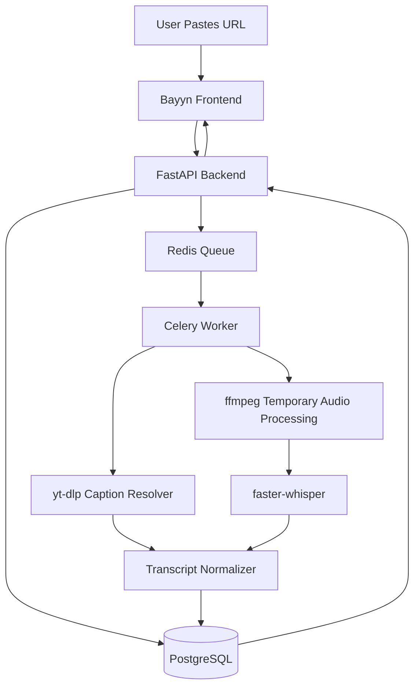

# Bayyn

> Paste a link. Get the transcript. Keep the knowledge, not the media.

## What is Bayyn?

Bayyn is a privacy-first URL-to-transcript application. Paste a video URL and get a clean, exportable transcript — without ever storing the video or audio file.

## Product Principle: Store Knowledge, Not Media

Bayyn processes video temporarily to extract the spoken word, then discards the media immediately. Only the transcript lives on. The database column `media_stored` is always `false` — enforced in code and verified by automated tests.

## What Is Stored

| Data | Stored |
|------|--------|
| Transcript full text | ✅ Yes |
| Timestamped segments | ✅ Yes |
| Source URL | ✅ Yes |
| Source type (youtube, etc.) | ✅ Yes |
| Video title | ✅ Yes |
| Duration (seconds) | ✅ Yes |
| Language | ✅ Yes |
| Processing status | ✅ Yes |
| Created date | ✅ Yes |

## What Is Never Stored

| Data | Stored |
|------|--------|
| Video files | ❌ Never |
| Audio files | ❌ Never |
| Thumbnails | ❌ Never |
| Downloaded media | ❌ Never |
| Temp file paths | ❌ Never logged |
| Raw media URLs | ❌ Never logged |

## Architecture



**Stack:**
- **Frontend**: Next.js 15, TypeScript, Tailwind CSS, shadcn/ui, TanStack Query
- **Backend**: FastAPI, Python 3.12, SQLAlchemy 2.x, Alembic, asyncpg
- **Worker**: Celery, Redis
- **Database**: PostgreSQL 16
- **Transcription**: yt-dlp → captions first, ffmpeg + faster-whisper fallback

## Local Setup

### Prerequisites

- Docker and Docker Compose
- (Optional) Python 3.12 + Node 20 for local dev

### Run with Docker

```bash
cp backend/.env.example .env
# Edit .env and set SECRET_KEY to a strong random value:
# python -c "import secrets; print(secrets.token_hex(32))"
docker compose up --build
```

Frontend: http://localhost:3000  
Backend API: http://localhost:8000  
API Docs (dev only): http://localhost:8000/docs

## Environment Variables

| Variable | Default | Description |
|----------|---------|-------------|
| `APP_ENV` | `development` | Set to `production` to enable strict guards |
| `SECRET_KEY` | *(insecure default)* | **Required in production** — JWT signing key, ≥32 chars |
| `DATABASE_URL` | `postgresql+asyncpg://...` | Async DB URL |
| `SYNC_DATABASE_URL` | `postgresql://...` | Sync DB URL (Alembic + Celery) |
| `REDIS_URL` | `redis://redis:6379/0` | Redis URL |
| `CORS_ORIGINS` | `["http://localhost:3000"]` | Allowed CORS origins (JSON list) |
| `TEMP_DIR` | `/tmp/bayyn` | Temp processing dir (ephemeral) |
| `MAX_VIDEO_DURATION_SECONDS` | `7200` | Max video length |
| `JOB_TIMEOUT_SECONDS` | `3600` | Max worker job time |
| `MAX_TRANSCRIPT_CHARS` | `1000000` | Transcript size limit |
| `WHISPER_MODEL` | `large-v3` | faster-whisper model size |
| `RATE_LIMIT_PER_MINUTE` | `10` | Requests per minute per IP |
| `MAX_ACTIVE_JOBS_PER_USER` | `5` | Concurrent job limit per user |
| `MAX_DAILY_JOBS_PER_USER` | `20` | Daily job limit per user |
| `JWT_EXPIRE_MINUTES` | `10080` | Token lifetime (7 days) |
| `ENABLE_LLM_SUMMARY` | `false` | Enable optional AI transcript summaries |
| `OPENAI_API_KEY` | *(empty)* | Required when `ENABLE_LLM_SUMMARY=true` |

See [backend/.env.example](backend/.env.example) for the full annotated reference.

## API Endpoints

### Transcription

| Method | Path | Auth | Description |
|--------|------|------|-------------|
| `POST` | `/api/transcriptions` | Optional | Submit URL for transcription |
| `GET` | `/api/transcriptions` | Required | List your transcript history |
| `GET` | `/api/transcriptions/{id}` | Optional | Job status and metadata |
| `GET` | `/api/transcriptions/{id}/transcript` | Optional | Full transcript + segments |
| `PATCH` | `/api/transcriptions/{id}/segments/{seq}` | Optional | Edit a segment |
| `DELETE` | `/api/transcriptions/{id}` | Optional | Delete transcript |
| `GET` | `/api/transcriptions/{id}/export/txt` | Optional | Export as plain text |
| `GET` | `/api/transcriptions/{id}/export/srt` | Optional | Export as SRT subtitles |
| `GET` | `/api/transcriptions/{id}/export/docx` | Optional | Export as Word document |
| `POST` | `/api/transcriptions/{id}/summary` | Optional | AI-generated summary (if enabled) |

### Auth

| Method | Path | Description |
|--------|------|-------------|
| `POST` | `/api/auth/register` | Create an account |
| `POST` | `/api/auth/login` | Sign in, get JWT |
| `GET` | `/api/auth/me` | Verify token and get user info |

### Admin (requires `is_admin=true` in JWT)

| Method | Path | Description |
|--------|------|-------------|
| `GET` | `/api/admin/jobs` | List all jobs (filterable, paginated) |
| `GET` | `/api/admin/jobs/{id}` | Single job metadata |
| `GET` | `/api/metrics` | Processing metrics and statistics |

### System

| Method | Path | Description |
|--------|------|-------------|
| `GET` | `/health` | Liveness check |
| `GET` | `/health/detailed` | DB + Redis connectivity check |

## Worker Flow

1. Load job from PostgreSQL
2. Mark status → `processing`
3. Create isolated temp dir `/tmp/bayyn/{job_id}`
4. Extract metadata via yt-dlp (no media download)
5. **Caption-first**: fetch available captions → normalize → store segments
6. **Whisper fallback**: resolve audio stream → ffmpeg pipe → faster-whisper → store segments
7. Store `transcript_documents` + `transcript_segments` in PostgreSQL; set `media_stored = false`
8. Mark status → `completed`
9. **Delete temp dir immediately**
10. Write audit log

On any error: temp dir deleted, retry with exponential backoff (up to 3 attempts), then dead-letter.

## Security Model

- **SSRF protection**: URL validator blocks private IPs (RFC 1918, loopback, link-local, AWS metadata), unsupported schemes (`file://`, `ftp://`, `javascript:`)
- **Rate limiting**: per-IP via slowapi (POST route); per-user DB checks (active jobs cap + daily cap)
- **Auth**: PBKDF2-HMAC-SHA256 passwords + HS256 JWT; `is_admin` claim embedded in token
- **Ownership**: job endpoints return 404 for wrong-user or missing (anti-enumeration)
- **Admin boundary**: `RequiredAdmin` dependency verifies `is_admin` from JWT — no extra DB query
- **Observability**: `ContextVar` request ID propagation; JSON structured logging; paths logged as SHA-256 hashes only
- **Production guards**: startup fails if `SECRET_KEY` is the insecure default, too short (<32 chars), or `DATABASE_URL` is localhost
- **API docs disabled in production** (`docs_url=None` when `APP_ENV=production`)

## Blocked IP Ranges

```
127.0.0.0/8       # Loopback
10.0.0.0/8        # Private
172.16.0.0/12     # Private
192.168.0.0/16    # Private
169.254.0.0/16    # Link-local (AWS metadata at 169.254.169.254)
::1               # IPv6 loopback
fc00::/7          # IPv6 unique local
fe80::/10         # IPv6 link-local
```

## Temp File Policy

- Every job gets its own isolated temp directory `/tmp/bayyn/{job_id}/`
- Deleted on success (reason=`completed`)
- Deleted on failure and retry (reason=`failure`)
- Startup cleanup removes stale dirs older than 1 hour
- Periodic Celery beat task (`cleanup_stale_temp_dirs`) runs the same sweep
- Temp paths never exposed via API or logs — only SHA-256 hash logged

## Testing

```bash
# Backend — unit + integration tests (asyncpg-dependent tests skip if no DB)
cd backend
pip install -e ".[dev]"
pytest --cov=app --cov-report=term-missing

# Backend — full suite with DB (Docker)
docker compose run --rm backend pytest --cov=app

# Frontend — E2E Playwright tests
cd frontend
npm install
npx playwright install --with-deps chromium
npx playwright test
```

CI runs automatically on every PR via GitHub Actions (`.github/workflows/ci.yml`).

## Roadmap

- [x] Phase 1: Repository and git setup
- [x] Phase 2: Backend foundation (FastAPI, models, migrations)
- [x] Phase 3: Security and URL validation
- [x] Phase 4: Job API endpoints
- [x] Phase 5: Queue and Celery worker
- [x] Phase 6: Source adapter framework (YouTube)
- [x] Phase 7: Caption-first transcription
- [x] Phase 8: Whisper fallback
- [x] Phase 9: Transcript APIs and exports
- [x] Phase 10: Frontend foundation
- [x] Phase 11: Frontend user flow
- [x] Phase 12: Docker Compose
- [x] Phase 13: Documentation and verification
- [x] Phase 14: Retry and dead-letter handling
- [x] Phase 15: Error handling and audit logging
- [x] Phase 16: Text cleaning and normalization
- [x] Phase 17: Long video chunking
- [x] Phase 18: Language detection
- [x] Phase 19: Caption confidence scoring
- [x] Phase 20: Segment editing API
- [x] Phase 21: Export formats (TXT, SRT, DOCX)
- [x] Phase 22: Soft delete
- [x] Phase 23: Progress tracking
- [x] Phase 24: User authentication (PBKDF2 + JWT)
- [x] Phase 25: Auth endpoints and frontend auth API
- [x] Phase 26: User ownership and authorization
- [x] Phase 27: Per-user rate limiting
- [x] Phase 28: Admin role and visibility
- [x] Phase 29: Observability (request ID, structured logging)
- [x] Phase 30: Metrics endpoint
- [x] Phase 31: Frontend auth UI (login, register, history guard)
- [x] Phase 32: E2E Playwright tests
- [x] Phase 33: Integration testing
- [x] Phase 34: Security testing (SSRF, JWT forgery, sanitization)
- [x] Phase 35: Temp file compliance testing
- [x] Phase 36: Performance benchmarks
- [x] Phase 37: GitHub Actions CI pipeline
- [x] Phase 38: Production config (startup guards, CORS, .env.example)
- [x] Phase 39: LLM summary plugin (optional OpenAI integration)
- [x] Phase 40: QA assertions (cross-cutting invariant tests)
- [x] Phase 41: Documentation update
- [x] Phase 42: Release preparation
- [ ] Phase 43: Final release

## Quick Start Verification

After `docker compose up --build`:

```bash
# Health check
curl http://localhost:8000/health

# Register and get a token
TOKEN=$(curl -s -X POST http://localhost:8000/api/auth/login \
  -H "Content-Type: application/json" \
  -d '{"email": "you@example.com", "password": "yourpassword"}' | jq -r .access_token)

# Submit a YouTube URL
curl -X POST http://localhost:8000/api/transcriptions \
  -H "Authorization: Bearer $TOKEN" \
  -H "Content-Type: application/json" \
  -d '{"url": "https://www.youtube.com/watch?v=dQw4w9WgXcQ"}'

# Check job status (replace {job_id})
curl -H "Authorization: Bearer $TOKEN" \
  http://localhost:8000/api/transcriptions/{job_id}

# Get transcript when completed
curl -H "Authorization: Bearer $TOKEN" \
  http://localhost:8000/api/transcriptions/{job_id}/transcript
```

## Verification Checklist

- [x] Frontend opens at http://localhost:3000
- [x] User can register and sign in
- [x] User can paste YouTube URL
- [x] Job is created and returns `job_id`
- [x] Worker picks up job and processes it
- [x] Caption-first strategy works for captioned videos
- [x] Whisper fallback works for non-captioned videos
- [x] Transcript stored in PostgreSQL only; `media_stored` always `false`
- [x] Temp directory deleted after processing (success + failure + retry)
- [x] Transcript can be viewed in the UI (full + segments tabs)
- [x] Transcript can be exported as TXT, SRT, DOCX
- [x] Transcript can be deleted (soft delete)
- [x] Transcript history is user-scoped (other users get 404)
- [x] Private IP URLs rejected (SSRF protection)
- [x] `localhost` URLs rejected
- [x] `file://` URLs rejected
- [x] Audio stream URLs never appear in logs (sanitized)
- [x] Admin users can view all jobs at `/api/admin/jobs`
- [x] Metrics available at `/api/metrics` (admin only)
- [x] Request ID in every response header (`X-Request-ID`)
- [x] Production startup rejects insecure `SECRET_KEY`

## Security

See [SECURITY.md](SECURITY.md) for full details on URL validation, IP blocking, rate limiting, and temp file policy.

---

*Bayyn does not store video or audio. Only the transcript is saved.*
